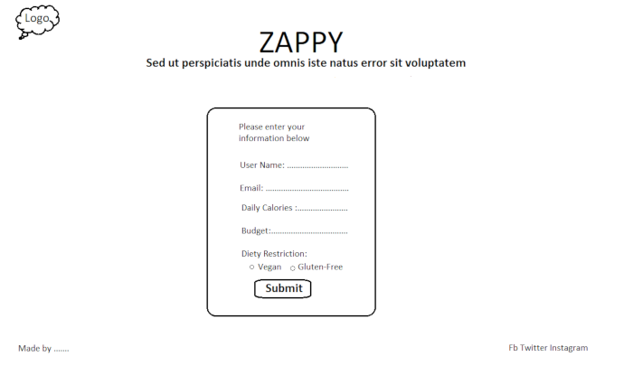
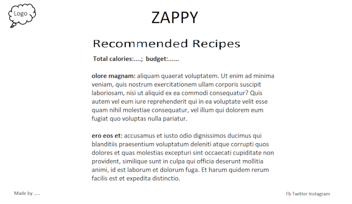
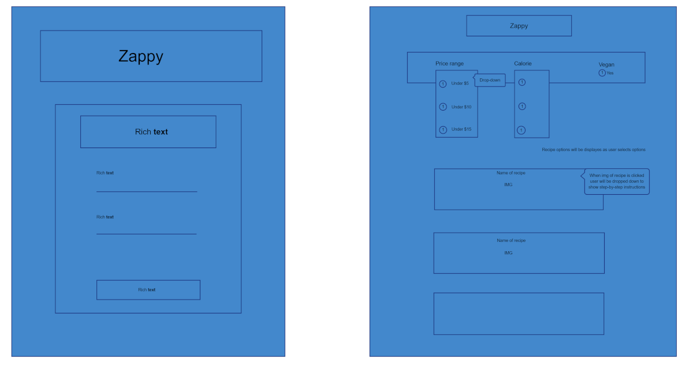

# Zappy Recipe Website

## Front End

-----------------------------------

Front end will consist of a login page and a landing page where users can select from budget, calorie, and vegan options to display recipes.

After making a selection from the previously mentioned choices, the user will see a list of 3 recipe options determined by their criteria.

Clicking on one of the recipes will take the user down to the recipe where it will list all of the ingredients and a step-by-step process to prepare the dish.

## Back End

-----------------------------------

### API Information

Tasty API will be used to find the recipes. 

- [Tasty - Recipe API](https://rapidapi.com/apidojo/api/tasty/)

Kroger API will be used to find pricing and determine budget friendly dishes.

- [Kroger - Ingredient API](https://developer.kroger.com/reference/)

### Application Logic

Login page will store username in local storage to determine that user is logged in. If username exists in local storage, user cannot access the login page again.

After logging in, user will be redirected to main landing page where they can make a selection. Selection will determine which 3 recipes are displayed. After clicking on a recipe, the page will slide down to show the full detail and process of making the dish.